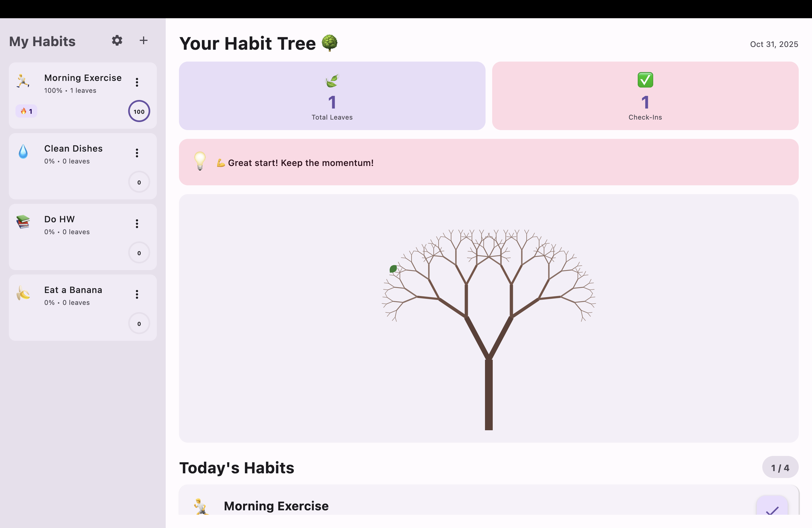

# 🌳 Micro Habit Tree

A habit tracking app that visualizes your progress as a growing tree. Every completed habit adds a leaf to your tree, creating a living representation of your consistency and dedication.




## ✨ Features

- 🌱 **Unified Tree Visualization** - All your habits contribute to one beautiful tree
- 🔥 **Streak Tracking** - Monitor daily streaks and celebrate consistency
- 📊 **Weekly Calendar** - See your progress at a glance
- 🎯 **Achievement Badges** - Unlock rewards (Week Warrior, Monthly Master, Century Club)
- 💡 **Motivational Messages** - Dynamic encouragement based on your progress
- 🎨 **64 Emoji Icons** - Choose from 8 categories (Health, Food, Study, Work, etc.)
- 🌓 **Dark Mode** - Easy on the eyes, day or night
- 💾 **Export/Import** - Backup and restore your data
- 📱 **Simple Interface** - Clean, intuitive design focused on what matters

## 🚀 Quick Start

### Prerequisites
- **Java 17 or higher** 
- **macOS, Windows, or Linux**

### Installation

1. **Clone the repository**
```
git clone https://github.com/JManoj01/Micro-Habit-Tree.git
cd Micro-Habit-Tree/MicroHabitTree
```

2. **Run the app**
```
./gradlew run
```

On Windows:
```
gradlew.bat run
```

That's it! The app will launch automatically.

## 📖 How to Use

### 1️⃣ Create Your First Habit
- Click the **+** button in the sidebar
- Choose an emoji icon
- Name your habit (e.g., "Morning Exercise")
- Click **Create Habit**

### 2️⃣ Track Daily Progress
- Click the ✓ button next to each habit to mark it complete
- Watch a new leaf grow on your tree! 🍃
- Build streaks by completing habits every day

### 3️⃣ View Your Progress
- **Tree grows** with every completed habit
- **Weekly calendar** shows your consistency
- **Stats dashboard** displays:
  - 🔥 Perfect day streaks
  - 🍃 Total leaves grown
  - ✅ Total check-ins

### 4️⃣ Manage Habits
- Click **⋮** (three dots) on any habit card to:
  - ✏️ Edit name or icon
  - 🗑️ Delete habit

### 5️⃣ Settings
- Click ⚙️ (gear icon) to:
  - Change display period (7, 14, or 30 days)
  - Toggle dark theme
  - Export/import data
  - Clear all data

## 🛠️ Tech Stack

- **Language**: Kotlin 2.0.20
- **UI Framework**: Compose Multiplatform for Desktop
- **Build Tool**: Gradle 8.5
- **Data Storage**: JSON (local file system)
- **Architecture**: MVVM pattern with reactive state management

## 📂 Project Structure

```
MicroHabitTree/
├── src/main/kotlin/
│   ├── Main.kt                    # App entry point
│   ├── Models.kt                  # Data models (Habit, AppSettings)
│   ├── HabitRepository.kt         # Data persistence
│   ├── HabitViewModel.kt          # Business logic
│   └── ui/
│       ├── HabitTreeApp.kt        # Main app layout
│       ├── HabitSidebar.kt        # Habit list sidebar
│       ├── UnifiedTreeView.kt     # Tree visualization & main view
│       └── Dialogs.kt             # Create/edit/settings dialogs
├── build.gradle.kts               # Build configuration
└── settings.gradle.kts            # Project settings
```

## 🙏 Acknowledgments

- Built with [Compose Multiplatform](https://www.jetbrains.com/lp/compose-multiplatform/)
- Inspired by apps like Forest and Habitica
- Tree visualization algorithm based on recursive fractal branching
